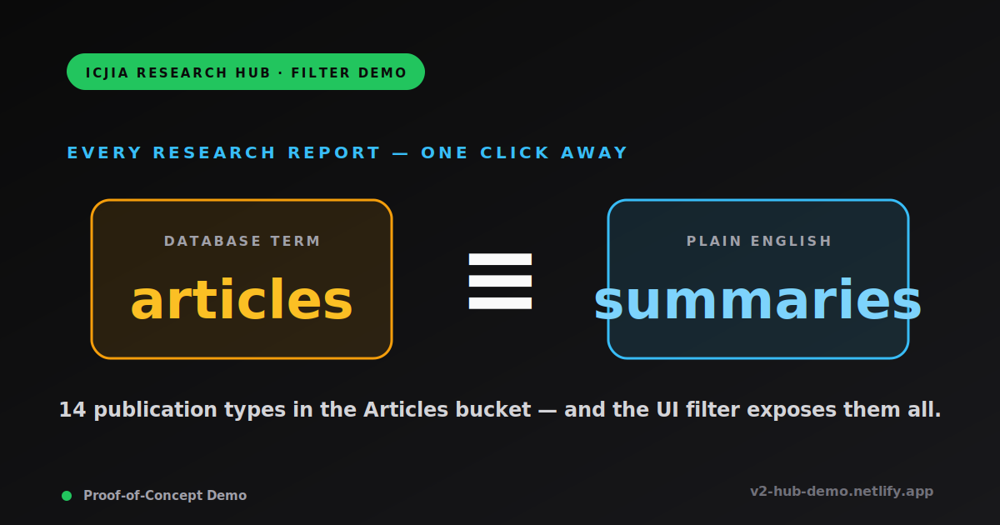

# V2 Hub Demo — Research Hub Article Filter POC

<p align="center">
  
</p>

**Live:** https://v2-hub-demo.netlify.app/

Proof-of-concept for ICJIA showing how the research hub article list could be filtered by publication type, topic, author, year, ICJIA Center, and tags, alongside a free-text search. The demo is built around a **skeptic-first narrative for non-technical managers**: lead with live Plausible traffic data and URL-stability evidence, then explain the architecture that made it work, then show the proposed UX tweaks.

Seven pages total. The narrative pages (`/`, `/about`, `/taxonomy`) are infographic-heavy explanations aimed at a manager who hasn't been close to the system; `/current` shows Hub 2.0 as it stands today (a baseline filter bar with no chips); `/view0`, `/view1`, `/view2` are three side-by-side filter-UX variants that layer the proposed friction-reducers on top of `/current`.

The article-list pages fetch live from the Strapi 5 GraphQL endpoint at `https://v2.hub.icjia-api.cloud/graphql`, hold all published articles in memory, and apply every filter client-side. Cards link to an internal stub detail page at `/articles/<slug>` so the demo is fully self-contained — no runtime traffic leaves this app. The narrative pages additionally pull live traffic data from a self-hosted Plausible instance via the `@icjia/plausible-mcp` tooling to ground claims in real numbers (last 12 months: 36.8K visitors, 232K pageviews, ~70% of all icjia.illinois.gov traffic).

## Quick start

```bash
pnpm install
pnpm dev
```

Then visit `http://localhost:3000/`.

```bash
pnpm typecheck   # type check
pnpm lint        # eslint
pnpm build       # production build (Nitro server)
pnpm generate    # static site generation (for Netlify)
```

## What the page does

### Data fetch

- Single GraphQL query against `https://v2.hub.icjia-api.cloud/graphql` (`useArticles` composable, `app/composables/useArticles.ts`). Pulls every article with `status: PUBLISHED`, `pagination.limit: 1000`, ordered server-side by `publishedAt` descending.
- Each article's record includes: `documentId`, `title`, `slug`, `abstract`, `type`, `date`, `publishedAt`, `tags`, `categories`, `authors[]` (objects with `title` and `description`), `splash` (with `url` and `alternativeText`).
- Articles missing a `type` value get a random one assigned client-side at fetch time via `pickRandomType()` so all fourteen `type` values are visible in the chip / dropdown UX during the demo. Toggleable: `useArticles({ fillRandom: false })` returns the raw set, used by `/taxonomy` so the type-card examples aren't polluted by the random fill. Different cache keys (`articles` vs `articles-raw`) keep the two flavors separate inside `useAsyncData`.
- Client-side, the array is sorted again by each article's `date` field (fallback `publishedAt`) so the displayed date drives the order. Filters and pagination operate on this sorted array.

### Card grid

- 1 / 2 / 3 columns at mobile / tablet / desktop. Card layout: 16:9 splash image (with explicit `width` / `height` to prevent CLS), publication-type badge (clickable), title (clickable via the wrapping `NuxtLink`), author byline (each name clickable), formatted date, abstract (line-clamp-5), tag pills (each clickable).
- The first card on every list page is rendered with `:priority="i === 0"`, which becomes `loading="eager"` + `fetchpriority="high"` on the splash image — improves the LCP metric.
- Cards link to an internal stub detail page at `/articles/<slug>` (`app/pages/articles/[slug].vue`). The detail page renders splash / type / title / byline / date / abstract / tags plus a "demo stub" notice and a Back-to-articles button. The demo never sends users to `v2hub.netlify.app`.

### Filter bar

The `ArticleFilterBar` component (`app/components/ArticleFilterBar.vue`) renders a single-line "Filter by:" row at desktop with up to five dropdowns plus a debounced search input plus a Clear-all button:

- **Publication Type** — derived from the Strapi `ENUM_ARTICLE_TYPE` values that appear in the data, formatted in human-readable Title Case (e.g. `researchAtAGlance` → "Research At A Glance"). Counts shown next to each entry. Only rendered when the page passes `:types`. View 0 and View 2 don't (they use chips instead); View 1 does.
- **Topics** — from the JSON `categories` field.
- **Centers** — hardcoded list of the five canonical ICJIA divisions (see below). Only rendered when the page passes `:centers`. View 1 doesn't.
- **Authors** — canonicalized (see Author canonicalization section).
- **Years** — derived from each article's `date` (or `publishedAt` fallback), descending.
- **Search** — free-text, debounced 300 ms, case-insensitive substring match against `title` and `abstract`.

Each dropdown leads with an `All …` reset entry, sized to fit the longest item label (capped at 32 chars so outlier "org-as-author" entries don't blow up the bar). Filters compose AND-style across categories. The **Clear all** button wipes every filter, including the page-level tag pills.

### Behavior details

- **Search highlighting.** Matched substrings inside each card's title and abstract are wrapped in `<mark>` via the `highlightSegments()` helper — splits the text into `{ text, match }[]` pairs using `indexOf`, no `v-html`, so query strings with HTML or regex chars are safe.
- **Additive (OR) tag filtering.** Click one tag and the grid filters to articles with that tag. Click another and the grid widens to articles with *either* tag. State is `selectedTags: string[]` (not a single string). Each active tag shows as a removable pill near the result count.
- **Search starts → clear other filters.** When the search transitions from empty to non-empty, every other filter (type, topic, author, year, center, tag) resets so the search runs against the full dataset. Only triggers on the empty → non-empty transition; subsequent keystrokes don't re-trigger the reset.
- **Smooth scroll-to-top** when a card-click filter is applied so the filter bar comes back into view.
- **Pagination** via `UPagination`, 12 per page, resets to page 1 on any filter change. Has `aria-label="Article pagination"` for screen-reader landmark uniqueness.

## Routes

- **`/` — Home page.** Visual orientation aimed at a skeptical non-technical manager. Eleven infographic sections in evidence-first order:
  1. Hero — orientation
  2. **Why this demo** — `articles ≡ summaries` equivalence answering "I want a summary, not an article"
  3. **Hub 1.0 in numbers** ("Proof — the hub already works") — live Plausible traffic for the production hub: 36.8K visitors, 232K pageviews, ~70% of icjia.illinois.gov traffic, 16-min average read time, top-five-articles bar chart with bounce rates, plain-English "What's a 'bounce'?" explainer, expandable "More from Plausible" with sources / devices / 12-month trend
  4. **URL stability / SEO** — why Hub 2.0 keeps `/researchhub/articles/…` URLs (Google rankings, ChatGPT citations, external backlinks all attached to specific URLs; renaming costs traffic)
  5. **Architecture diagram** — three interactive content-type cards (Articles / Datasets / Apps-Dashboards as tabs that swap content panel below); zoom into Articles with the 14 type pills (each clickable to open a live-examples modal)
  6. **What this demo adds** stat strip — POC counts (`~240` articles · `14` types · `3` filter layouts · `1` click)
  7. **"And one more thing… Author names."** — Steve Jobs-style reveal with a 6xl/7xl/8xl `font-black` infographic title, then a Problem/Solution split: "Riley Calder, Riley Calder PhD, JANE CARTER" 7-variant CMS dump (the Problem) vs. one canonical entry + five normalization steps (the Solution)
  8. TL;DR — "Every research report is one click away. *(Remember — articles **are** summaries.)*"
  9. Five takeaways — busy-manager skim cards
  10. **Current + three proposed views** — full-width "Start here · /current" card on top, then three view cards below with chip / dropdown / always-on previews
  11. Deep dives — links to `/taxonomy` and `/about`

  Respects the dark/light toggle (default dark).

- **`/current` — Current view (Hub 2.0 baseline).** Lives between Home and View 0 in the nav. Filter bar with Type / Topic / Author / Year / Center dropdowns + search — no chips, no chip-stacking. Framed as "Hub 2.0 as it stands today" — visitors land here to see the baseline before jumping into the three proposed views. Includes inline "Proposed tweaks:" buttons linking to View 0 / 1 / 2.

- **`/view0` — View 0 (chips + Advanced filters toggle).** A row of quick-pick chips (`All`, plus pluralized Research Reports, Annual Reports, Program Evaluation Summaries, Updates, Strategic Plans). The full filter bar (Topics, Centers, Authors, Years, Search) is hidden behind a violet-bordered, high-contrast **Advanced filters** toggle. The hypothesis: chips are usually enough; reveal the bar only when needed. Clicking the `All` chip is a full reset.

- **`/view1` — View 1 (dropdown-only).** All filtering, including Publication Type, lives in the filter bar. No chip row, no Centers dropdown — this is the "centers removed" UX from the original brief, closest to the live site today.

- **`/view2` — View 2 (chips with always-on filter bar).** Same chip row as View 0, with the full filter bar (Topics, Centers, Authors, Years, Search) always visible alongside. No Advanced toggle.

The home page makes the *case* for the demo with evidence; `/current` is the baseline; Views 0–2 are three filter-UX flavors for managers to compare against the same dataset.

There's also a separate `/taxonomy` page (linked as **How is the Hub organized?** on the right side of the header) that explains the underlying Strapi 5 data model in plain English using infograph treatments — three interactive content-type tabs (Articles / Datasets / Apps-Dashboards) with content that swaps in place, a 14-type interactive grid (clickable to modal with real examples), and a "Hub 1.0 by the numbers" section mirroring the home page's Plausible evidence as proof that the structure works.

The chip set and the canonical Centers list are shared across pages via `CHIP_TYPES` and `KNOWN_CENTERS` exports in `app/utils/article-format.ts` — adding a new chip or center happens in one place.

Both `ArticleFilterBar` consumers conditionally render Type / Centers based on which item arrays the page passes in.

The Centers dropdown is hardcoded to the five canonical ICJIA divisions so all of them always appear (with live counts of matching articles, including zero counts):

- Center for Justice Research and Evaluation
- Center for Sponsored Research & Program Development
- Center for Victim Studies
- Center for Violence Prevention and Intervention Research
- Research & Analysis Unit

## "Why this demo app?" page (`/about`)

Top-right of the header, the **Why this demo app?** button links to `/about` (`app/pages/about.vue`). Five infograph sections aimed at the same skeptical manager:

1. **Hero** — H1 "Seven small upgrades. One big difference." with four CTAs (Home / Current / View 0 / View 1 / View 2)
2. **Stat strip** — four interactive popover tiles (`7 upgrades · 1 click to find research reports · 1 entry per author · 5 ICJIA Centers always visible`); each tile reveals a 1-2 sentence explainer in a UPopover on click/focus
3. **The seven upgrades** — interactive grid where each card opens a detail modal with "What it does" + "Why it matters" + "Try it →" CTAs (the modal carries the Hub 1.0 / Hub 2.0 framing positively: what Hub 2.0 *does*, and how Hub 1.0 doesn't yet have it)
4. **TL;DR** — "Everything's already on the hub. This proof-of-concept demo just exposes it."
5. **Deep dives** — `/taxonomy` and `/`

Upgrade content lives in a typed `Upgrade[]` array in the script setup: `title`, `shortBody`, `description`, `whyItMatters`, `links: { label, to }[]`, `accent`, optional `visual: 'click-equivalence' | 'author-merge'` for two upgrades that get richer in-modal visuals. Adding a card is one array entry plus an accent class lookup. Modal markup is inline in the SFC (no extracted component) so each upgrade can have its own copy and visual treatment without a prop explosion.

The seven upgrades:

1. **Find research reports in one click** (amber, click-equivalence visual) — chips at the top of every view
2. **Search highlights what it matched** (emerald) — yellow `<mark>` inside title and abstract
3. **Click any author for their work** (violet) — clickable bylines
4. **One author entry, every variant matched** (violet, author-merge visual) — canonicalization (see section below)
5. **Click tags. Stack them.** (amber) — additive (OR) tag filtering with removable pills
6. **Filter by ICJIA Center** (sky) — the five canonical centers, always visible
7. **Current + three proposed views** (zinc, full-width) — Current baseline + Views 0/1/2 with three sub-CTAs in the modal

## How is the Hub organized? page (`/taxonomy`)

A non-filter explainer page accessible via the **How is the Hub organized?** button on the right side of the header. Audience: non-technical managers who use the research hub but have never thought about how the data behind it is organized. Eight infograph sections in this order:

1. **Hero** — "How Hub 2.0 organizes everything it publishes" with four CTAs (Current / View 0 / 1 / 2)
2. **Stat strip** — four interactive popover tiles (`3` top-level content types · `14` named article types · `1` shape inherited from Hub 1.0 · `4` patterns proposed for the datahub)
3. **The architecture** — H2 "Same bones. Updated CMS. *Click the content types.*" Three interactive content-type cards (Articles / Datasets / Apps-Dashboards) function as **tabs** that swap content in an inline detail panel directly below. Selected card gets full accent treatment (amber / sky / violet); unselected cards are dimmed zinc. Defaults to Articles selected. Content panels:
   - **Articles** (amber) — what it is, why the demo focuses on it, anchor link to the 14-type grid below
   - **Datasets** (sky) — what it is, then the full datahub roadmap with all four patterns inline (Solo dataset · One app, one dataset · One app, many datasets · Shared dataset) plus the emerald "schema-supported in Strapi 5 today" callout
   - **Apps/Dashboards** (violet) — what it is + amber-bordered "More detail coming soon" warning + "What we know so far" bullet list of schema-level facts
4. **Hub 1.0 ≡ Hub 2.0 equivalence visual** — `3 buckets · 14 types` on both sides
5. **"Why 'articles' and not 'summaries'?"** — amber-tinted callout with the historical naming decision verbatim from the home page
6. **The 14 Article types (interactive grid)** — `id="types"` anchor; clickable to a modal listing real top-2 examples from `useArticles({ fillRandom: true })`
7. **Proposed datahub** — eyebrow "What's next" with a Future badge; four colored relationship cards (Solo dataset · One app, one dataset · One app, many datasets · Shared dataset) using Lucide icon-relationship art (`i-lucide-database`, `i-lucide-layout-dashboard`, `i-lucide-arrow-right`); emerald-bordered closing tile reinforcing schema-supported-today
8. **TL;DR** — "Hub 2.0 inherited the structure that **already works**." Supporting paragraph cites concrete evidence: `36,800 hub visitors and 232K pageviews` in the last twelve months, top articles ranking on Google for years, ChatGPT and external citations
9. **Hub 1.0 by the numbers** — full mirror of the home page's Plausible section (4-tile stat strip, top-five-articles bar chart with bounce rates) deliberately duplicated here so the TL;DR's "already works" claim has its receipt right beside it
10. **Deep dives** — `/about` and `/`

Mermaid diagrams that originally lived on this page (the structure ribbon and the datahub four-pattern flowchart) were replaced in v0.1.85+ with bespoke infograph treatments — the `MermaidDiagram` component is no longer imported by `/taxonomy`, but the file is still present in `app/components/` for any future use. The `mermaid` package itself remains in `dependencies` against any future need.

## Click-to-filter on cards

Three card elements double as filters — click them and the grid narrows without leaving the page. The page also smooth-scrolls back to the top so the filter bar is in view.

- **Publication type badge** — sets the Publication Type filter (chip on View 0 / View 2, dropdown on View 1) to that type.
- **Author name** in the byline — sets the Authors dropdown to the canonical key for that name (so every credential variant for the same person matches).
- **Tag badge** — adds the tag to the active tag filter. Tag filtering is **additive (OR-composed)**: clicking multiple tags widens results to articles matching *any* selected tag. Each active tag shows as a removable pill (`Tag: foo ×`) next to the result count; clicking the same card-tag again toggles it off.

## Author canonicalization strategy

> This is the most opinionated piece of the demo. If you port these filters into the live hub, port this **first** — without it, the same person renders as multiple dropdown entries and the filter is unusable. All of it lives in `app/utils/article-format.ts` and `app/pages/index.vue` (mirrored to `view1.vue` / `view2.vue`).

### Why it's needed

Authors come back from Strapi as `{ title: string, description: string | null }[]`. The same person frequently appears under multiple `title` values, in three flavors:

| Source variant                            | Reason                  |
|-------------------------------------------|-------------------------|
| `Riley Calder` / `Riley Calder, Ph.D` / `Riley Calder, PhD` / `Riley Calder, PHD` / `Riley Calder, PH.D` | Credential suffix, mixed casing |
| `DAKOTA HARLOW` vs `Dakota Harlow`              | Casing                  |
| `Research & Analysis Unit` vs `Research and Analysis Unit` | `&` vs `and` connector |
| `  Riley Calder ` (with surrounding space) | Editor whitespace       |

A naive `Set<string>` over titles produces ~180 distinct entries when the data really has more like ~120 distinct people/orgs.

### The canonical key

Every author title is run through one pure function that returns a **canonical key**. The key is what's used to:

1. **Group** variants in the Authors / Centers dropdown items.
2. **Compare** an article's authors against the selected filter value.

The filter never compares raw titles to raw titles — only `authorKey(title) === selectedKey`. That's why every variant on every article matches its group.

```ts
// app/utils/article-format.ts
export function authorKey(name: string): string {
  return name
    .replace(/,.*$/, '')        // 1. drop credentials suffix
    .replace(/\s*&\s*/g, ' and ') // 2. unify "&" with " and "
    .replace(/\s+/g, ' ')        // 3. collapse internal whitespace
    .trim()                      // 4. trim leading/trailing whitespace
    .toLowerCase()               // 5. lowercase
}
```

#### Step-by-step

| Step | Regex / op                | Purpose                                                   | Example                                                  |
|-----:|---------------------------|-----------------------------------------------------------|----------------------------------------------------------|
| 1    | `name.replace(/,.*$/, '')`  | Drop the comma and everything after — credentials, suffixes, post-nominals. | `Riley Calder, Ph.D` → `Riley Calder`               |
| 2    | `.replace(/\s*&\s*/g, ' and ')` | Normalize ampersand-vs-"and" so org variants merge.   | `Research & Analysis Unit` → `Research and Analysis Unit` |
| 3    | `.replace(/\s+/g, ' ')`   | Collapse runs of whitespace (tabs, double spaces).         | `Riley   Calder` (double space) → `Riley Calder`         |
| 4    | `.trim()`                | Drop leading/trailing whitespace introduced by editors.    | `  Riley Calder ` → `Riley Calder`                       |
| 5    | `.toLowerCase()`         | Make the key case-insensitive so `DAKOTA HARLOW` matches `Dakota Harlow`. | `Dakota Harlow` → `dakota harlow`                  |

#### Concrete worked examples

| Raw `title`                                  | Canonical key               |
|----------------------------------------------|-----------------------------|
| `Riley Calder`                                | `riley calder`              |
| `Riley Calder, Ph.D`                          | `riley calder`              |
| `Riley Calder, PHD`                           | `riley calder`              |
| `DAKOTA HARLOW`                                  | `dakota harlow`                |
| `Research & Analysis Unit`                    | `research and analysis unit`|
| `Research and Analysis Unit`                  | `research and analysis unit`|
| `Avery del Mar, PhD, MPA, MA`              | `avery del mar`          |

### Picking the display name per group

Inside the page's `authorItems` computed, each canonical key becomes one dropdown entry. The label shown to users is the **most-used variant** in the dataset; ties are broken by **shorter** (which naturally favors the clean name without credentials).

```ts
// pseudo-code from app/pages/index.vue
const groups = new Map<string, Map<string /*variant*/, number /*count*/>>()
for (const article of articles.value) {
  for (const name of articleAuthorNames(article)) {
    const key = authorKey(name)
    if (!key) continue
    const variants = groups.get(key) ?? new Map()
    variants.set(name, (variants.get(name) ?? 0) + 1)
    groups.set(key, variants)
  }
}

// for each group, pick the variant with the highest count;
// on tie, prefer the shorter one
const items = [...groups].map(([key, variants]) => {
  let best = '', bestCount = -1
  for (const [name, count] of variants) {
    if (count > bestCount || (count === bestCount && name.length < best.length)) {
      best = name; bestCount = count
    }
  }
  return { label: best, value: key }
})
```

So if `Riley Calder` has 95 occurrences and `Riley Calder, MS` has 4, the dropdown shows `Riley Calder`.

### How filtering uses the key

```ts
// the filter value stored on the page is the canonical key, not a display name
if (selectedAuthor.value) {
  r = r.filter(a =>
    articleAuthorNames(a).some(n => authorKey(n) === selectedAuthor.value)
  )
}
```

Card click handlers also emit the canonical key, not the display name:

```vue
<!-- ArticleCard.vue -->
<button @click="emit('select-author', authorKey(name))">{{ name }}</button>
```

### What it deliberately does NOT merge

- **Typos.** `Jordon Reeves` vs `Jordan Reeves` — would require fuzzy/edit-distance matching (Levenshtein, Jaro-Winkler, etc.), which risks false collapses across genuinely different people.
- **Middle-initial differences.** `Sam Whitley` vs `Sam B. Whitley, BS` — could be the same person or two different ones; the algorithm treats them as separate.
- **Reordered names.** `Smith, John` (last-first) vs `John Smith` — not seen in the data, but if it shows up, current logic strips at the first comma so `Smith, John` becomes `Smith`. Watch for this.
- **Diacritics / accents.** `Émile Tanaka` vs `Emile Tanaka` — currently distinct. Add `.normalize('NFD').replace(/\p{Diacritic}/gu, '')` to the chain if your data has these.

The bias is **toward under-merging**: it's better to occasionally show two entries for the same person than to wrongly fuse two different people into one filter.

### Recommended production path

For the live hub, do this once at the source rather than every page load:

1. Add a stable `slug` (or `personId`) field on the Strapi `author` content type and set it once when the author is created.
2. Articles relate to authors by ID, not by typed name.
3. Drop `authorKey()` from the frontend — query the unique authors directly.

Until that lands, this client-side canonicalization keeps the filter usable. The same approach also powers the **Centers** dropdown (`centerItems` in `app/pages/index.vue`), which uses `authorKey()` on a hardcoded list of canonical center names from `KNOWN_CENTERS` in `app/utils/article-format.ts`.

## Random publication-type fill (POC only)

Roughly 80 % of the articles in the source CMS don't have a `type` set yet. To make the filter behavior visible across all fourteen enum values during the demo, articles missing a `type` get a random one assigned **client-side at fetch time** — the Strapi data is never modified. Counts will shift between deploys because the assignment is non-deterministic.

Two ways to opt out:

- **Per-call:** `useArticles({ fillRandom: false })` returns the raw articles unchanged. The `/taxonomy` page uses this so the per-type example modal only shows real, tagged examples. The cache key (`articles-raw` vs `articles`) keeps the two variants separate inside `useAsyncData`.
- **Global remove:** once Strapi is fully tagged, delete the `pickRandomType()` call inside `useArticles()` and the random fill is gone for everyone.

## Accessibility notes

The demo is targeted at WCAG 2.1 AA. Recent fixes:

- **Heading order.** Page H1 → card H2 (one level deep) so axe-core's `heading-order` rule passes. Modal headings start fresh under the modal title.
- **Landmark uniqueness.** Both `<nav>` regions (header `UNavigationMenu` + page `UPagination`) carry distinct `aria-label`s (`"View navigation"` and `"Article pagination"`).
- **Touch target size.** Tag buttons inside cards are `inline-flex min-h-6 min-w-6` so they meet WCAG 2.5.8's 24 × 24 minimum.
- **Search-match contrast.** `<mark class="bg-primary/40">` keeps the highlight legible against light and dark cards.
- **Mermaid contrast.** The `MermaidDiagram` component sets `themeVariables.lineColor` / `textColor` / `clusterBorder` / `titleColor` from the current color mode, with `clusterBkg: 'transparent'` so the page bg shows through subgraph rectangles cleanly.
- **Keyboard.** All clickable elements are `<button>` or `<NuxtLink>`; tab order follows DOM order; focus-visible ring uses Nuxt UI's primary color token.

## Project layout

```
app/
  app.vue                              # shell — header (nav + demo badge + Why this demo app?
                                       #   link + How-is-the-hub-organized? link + color-mode toggle), main,
                                       #   footer (version + Changelog + GitHub)
  pages/
    index.vue                          # / — visual orientation home page (11 infograph sections)
    current.vue                        # /current — Hub 2.0 baseline (filter bar, no chips)
    view0.vue                          # View 0 — chips with Advanced toggle for the bar
    view1.vue                          # View 1 — dropdown-only bar (no chips, no Centers)
    view2.vue                          # View 2 — chips with always-on bar
    about.vue                          # /about — Why this demo app? (interactive 7-card grid + modals)
    taxonomy.vue                       # /taxonomy — How is the Hub organized? (interactive content-type tabs)
    articles/[slug].vue                # internal stub article detail page
  components/
    ArticleCard.vue                    # single card with click-to-filter on type/author/tag
    ArticleFilterBar.vue               # conditional Type / Topics / Centers / Authors / Years
                                       #   / search + Clear all
    ArticleTypeChips.vue               # the chip row used by View 0 and View 2
    ArticleTypeExamplesModal.vue       # modal showing top-2 examples for a clicked type
    HubArticleTypeGrid.vue             # interactive grid of 14 article types (list/compact)
    MermaidDiagram.vue                 # client-only Mermaid wrapper, color-mode aware
  composables/
    useArticles.ts                     # GraphQL query + fetch with optional random-type fill
  utils/
    article-format.ts                  # typeLabel / pluralize / imageUrl / formatDate /
                                       #   articleAuthorNames / authorKey / highlightSegments /
                                       #   CHIP_TYPES / KNOWN_CENTERS
```

## Deploying to Netlify (static)

This POC is set up for **fully static** deployment — `nuxt generate` prerenders every route at build time (Home, View 0, View 1, View 2, `/about`, `/taxonomy`, and the `/articles/<slug>` detail pages discovered by the crawler), baking the GraphQL response into the HTML. No Netlify Functions, no runtime fetches needed. The Strapi endpoint just has to be reachable from Netlify's build container (it's public, so it is).

Already in the repo:

- `netlify.toml` — `command = "pnpm generate"`, `publish = "dist"`, `NODE_VERSION = "22"`, `NODE_OPTIONS = "--max-old-space-size=4096"`. Netlify auto-detects the lockfile and uses pnpm. (`dist` is correct because Netlify's build container sets `NETLIFY=true`, which makes Nitro pick the `netlify-static` preset; that preset outputs to `dist/` rather than the local `.output/public/`.) The 4 GB heap bump is required: Nitro's prerender phase runs ~240 routes (4 list pages + `/taxonomy` + 236 `/articles/<slug>` detail pages) in a single Node process, and the default ~2 GB heap runs out partway through. With 4 GB the build completes cleanly. Raise to 6144 / 8192 if the catalog grows large enough that 4 GB stops being enough.
- `.nvmrc` — pins Node 22 for local development; matches Netlify's `NODE_VERSION` so local builds and deploys run on the same runtime.
- `pnpm generate` script — wraps `nuxt generate`, which sets the Nitro preset to `static` and prerenders all crawled routes. No `nitro.preset = 'netlify'` needed; that preset is for the SSR-on-functions path, which we don't want for a fully static demo.
- `useAsyncData('articles', …)` — the standard Nuxt primitive. At build time it runs once during prerender, the result is serialized into the page payload, and the client hydrates from that without a second fetch.

To deploy: connect the repo to Netlify, accept the auto-detected build settings, and ship. Each new deploy re-fetches articles and re-runs the random publication-type fill, so counts will shift between deploys until Strapi is fully tagged and the random fill is removed.

If you ever need fresher data without a deploy, switch to `nitro.preset = 'netlify'` in `nuxt.config.ts` and remove the `pnpm generate` step — the page will be SSR'd on a Netlify Function, fetching live on each request.

See [`CHANGELOG.md`](./CHANGELOG.md) for the full per-version history.